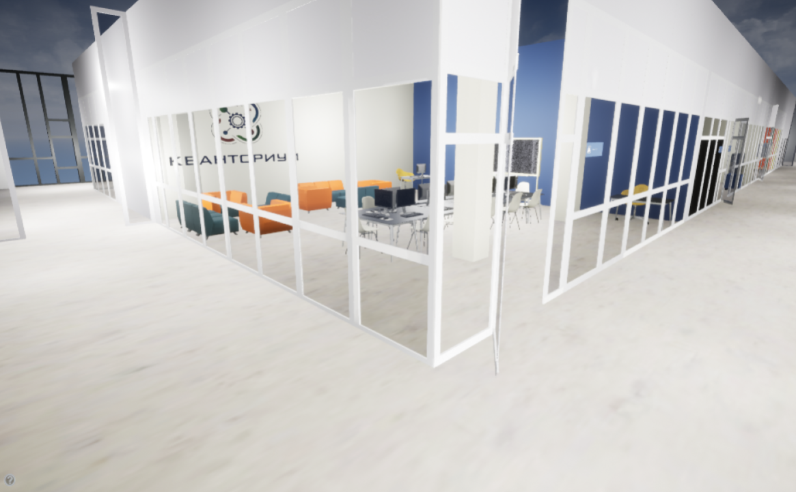
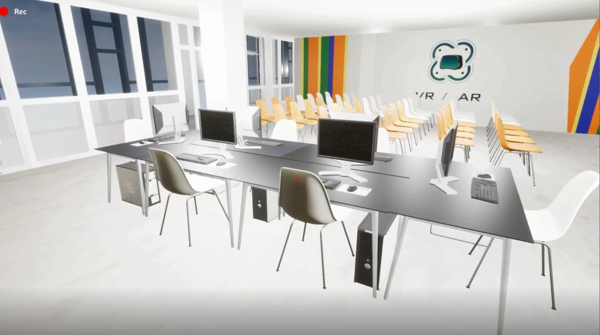
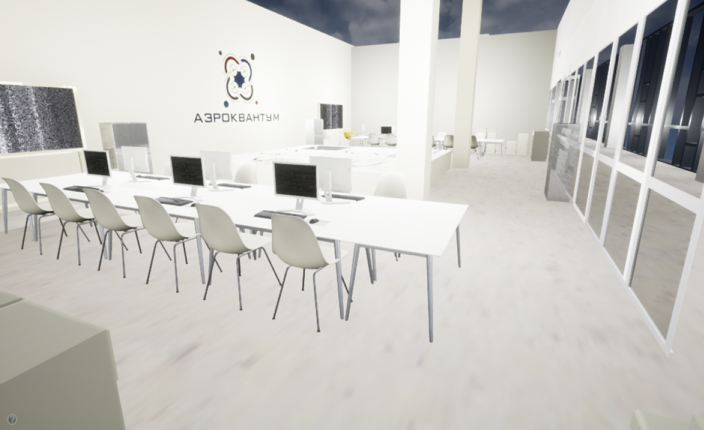
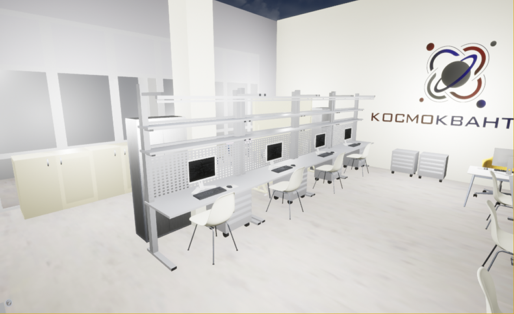
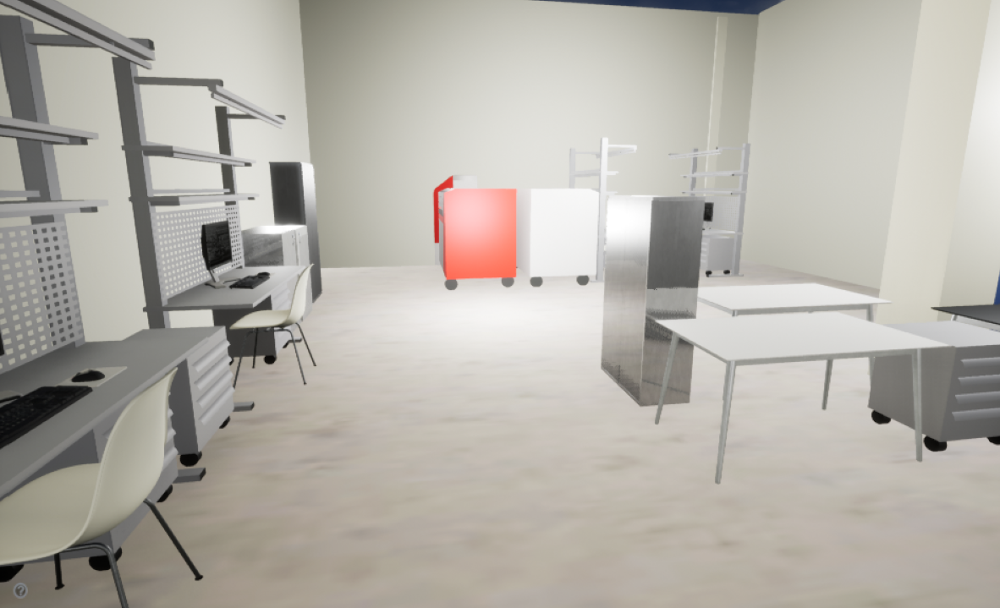
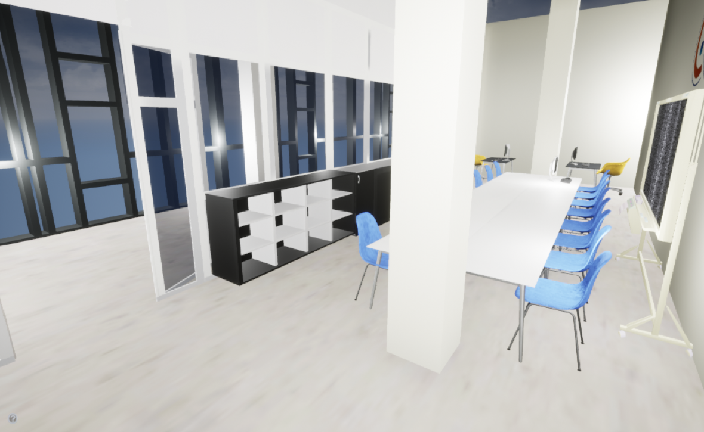

# Tour of the kvantorium

Проект представляет собой виртуальную копию технопарка Кванториум в городе Калининград. Приложение может быть запущено как с использованием VR шлема, так и без него.

---

# Images

---

# Tech
* 3D modeling
* Unreal Engine
---
# Developers
* Баканова М.В.
---

